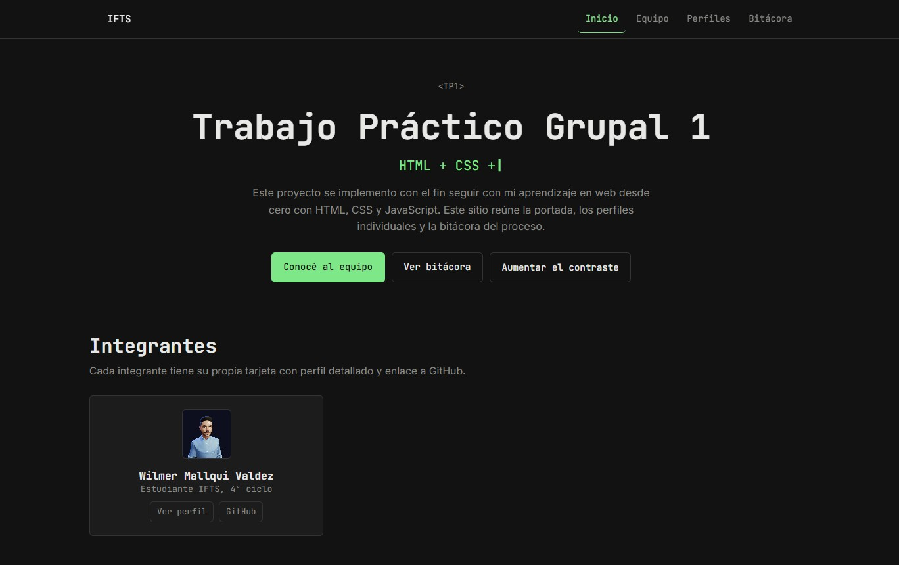
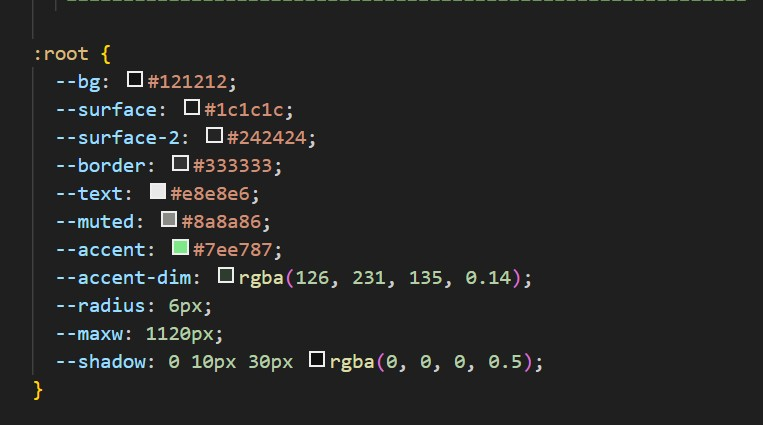
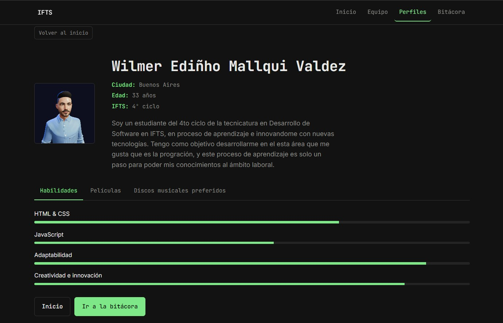
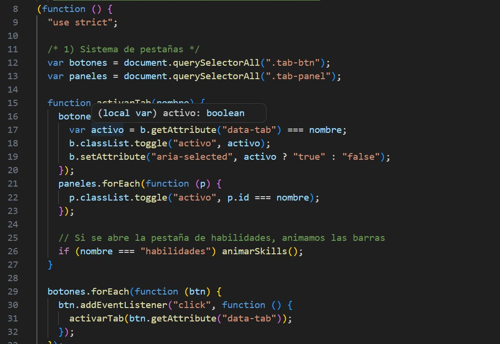
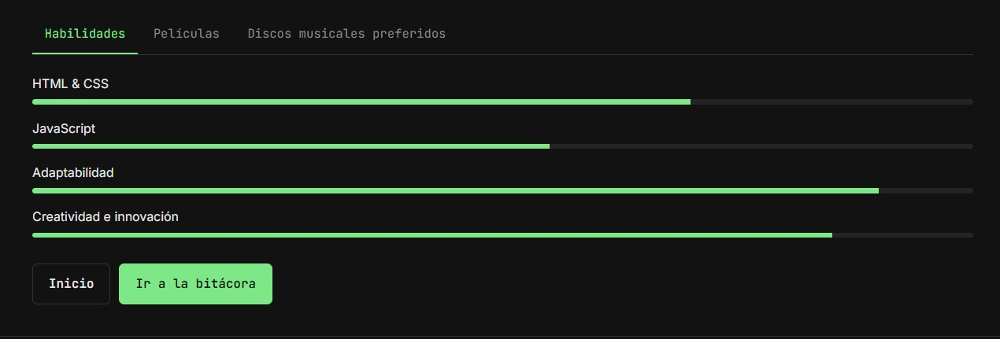
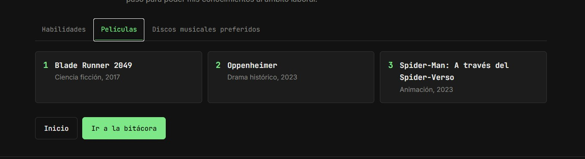
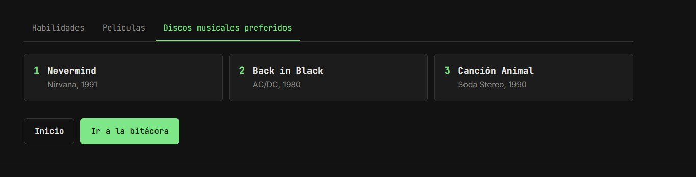
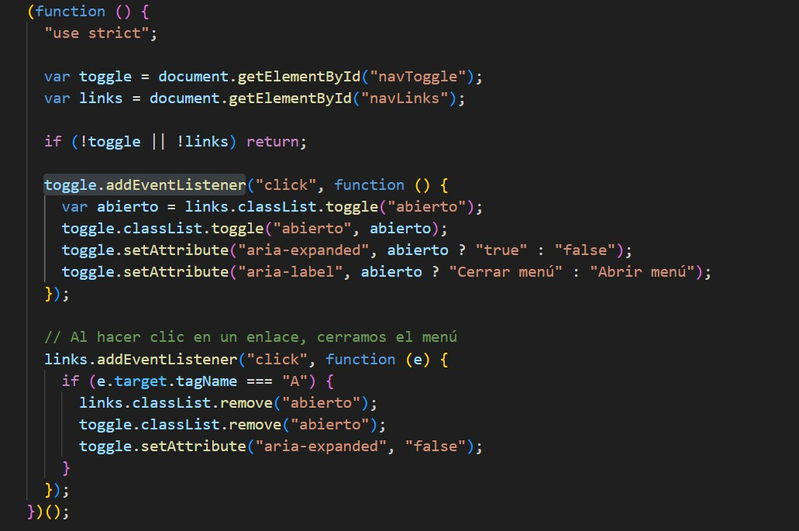

# Sitio web grupal (TP1 · IFTS)

Sitio web del equipo desarrollado para el **Trabajo Práctico Grupal 1** del
IFTS, construido con **HTML, CSS y JavaScript puro**. Incluye portada,
perfiles individuales, navegación interna y una bitácora del proceso.

> Nota: Este proyecto lo realicé de forma individual debido a que los
> integrantes de mi grupo nro 34 se retiraron y quedé solo en el proyecto.
> Traté de organizarme con otros grupos pero me dijeron que están
> completos. Pido mil disculpas por la inconveniente. Este sitio web
> diseñé para que se pueda agregar más integrantes por defecto

---

## Integrantes

| Nombre | Rol | GitHub |
| --- | --- | --- |
| Wilmer Ediñho Mallqui Valdez | Desarrollo y diseño | [github.com/wemvaldez1122](https://github.com/wemvaldez1122) |

**URL en Vercel:** [Proyecto en Vercel](https://proyecto1-wilmer7.vercel.app/)

---

## Tecnologías utilizadas

- **HTML5** — estructura semántica de las tres páginas.
- **CSS3** — Flexbox, Grid y media queries (sin frameworks).
- **JavaScript** (vanilla) — texto animado, pestañas y barras de habilidad.
- **Google Fonts** — JetBrains Mono + Inter.
- **Vercel** — publicación del sitio.
- **Git / GitHub** — control de versiones.

---

## Estructura de archivos

```
/
├── index.html            → portada: presentación + listado de integrantes
├── perfil-wilmer.html    → perfil individual (tarjeta detallada)
├── bitacora.html         → bitácora del proceso
├── README.md             → este documento
├── css/
│   └── estilos.css       → todos los estilos del sitio
├── js/
│   ├── menu.js            → menú responsive (compartido por las 3 páginas)
│   ├── portada.js         → interacciones dinámicas de la portada
│   └── perfil.js          → interacciones dinámicas del perfil
└── img/
    ├── foto-wilmer.jpg    → foto del integrante
    └── capturas/          → capturas de las funciones JS (para este README)
```



---

## Guía de estilos

Fui con una estética de un solo color de acento, tipografía monoespaciada
para títulos y datos, botones rectangulares (nada de píldoras con
degradado) y los metadatos del perfil mostrados como `clave: valor` en vez
de íconos o emojis.

### Paleta de colores

| Token | Hex | Uso |
| --- | --- | --- |
| Fondo | `#121212` | Fondo principal |
| Superficie | `#1c1c1c` | Tarjetas y bloques |
| Superficie 2 | `#242424` | Superficies elevadas |
| Borde | `#333333` | Bordes y divisiones |
| Texto | `#e8e8e6` | Texto principal |
| Texto tenue | `#8a8a86` | Texto secundario |
| Acento (único) | `#7ee787` | Enlaces, botón primario, datos destacados |



### Tipografías (Google Fonts)

- **JetBrains Mono** → logo, títulos, botones, prompts y datos puntuales (ciudad, edad, etc.)
- **Inter** → texto de cuerpo.

### Iconografía

- Sin emojis ni set de íconos: los datos del perfil van como texto
  `clave: valor` (por ej. `Ciudad: Buenos Aires`).
- El "logo" es tipográfico: `~$` antes del nombre del sitio, simulando un
  prompt de terminal, sin caja ni degradado.


---

## Funciones de JavaScript

### Portada (`js/portada.js`)

1. **Texto animado tipo terminal** — el subtítulo debajo del `<h1>` escribe
   y borra en bucle una lista de frases del equipo (efecto máquina de
   escribir), letra por letra.
2. **Aparición de los integrantes al hacer scroll** — cada tarjeta de la
   sección "Integrantes" arranca invisible y se revela con una animación
   (opacidad + desplazamiento) apenas entra en pantalla, con un pequeño
   retraso entre una tarjeta y la siguiente. Usa `IntersectionObserver`, así
   que no se dispara hasta que el usuario llega a esa sección.



### Perfil (`js/perfil.js`)

1. **Pestañas (tabs)** — alternan entre "Habilidades", "Películas" y
   "Discos" sin recargar la página; solo se actualizan clases CSS.
2. **Barras de habilidad animadas** — cada barra arranca en 0% y se
   completa hasta el valor de `data-nivel` cuando la sección entra en
   pantalla (`IntersectionObserver`), no apenas carga la página.
3. **Formulario de contacto** — Nombre, Correo electrónico y Mensaje, con
   validación básica de campos vacíos. Al enviar, arma un link `mailto:`
   con los datos cargados y abre el programa de correo del usuario (el
   sitio es estático, no tiene backend propio para mandar el mail).









### Menú (`js/menu.js`)

Menú responsive compartido por las tres páginas: abre y cierra la
navegación en pantallas chicas y mantiene actualizados los atributos ARIA
(`aria-expanded`) para lectores de pantalla.



---

## Diseño responsive

Trabajé mobile-first, con los tres breakpoints pedidos por la consigna:

- **400 px** — ajustes finos para pantallas chicas (botones no se rompen).
- **900 px** — aparece el menú horizontal, grillas pasan a 2 columnas y la
  portada deja de estar centrada (se alinea a la izquierda con un borde de
  acento tipo cursor de terminal).
- **1200 px** — grilla de 3 columnas y más aire en el layout general.

---

## Publicación

- **URL en Vercel:** [Proyecto en vercel](https://proyecto1-wilmer7.vercel.app/)

Para publicar: Se realizo la importación a Vercel y se creo el link para
uso público

---

## Uso de IA

- **Herramientas:** v0 (Vercel) y Claude (Anthropic), ambas en plan gratuito.
- **Experiencia previa:** poca — las había probado suelto antes de este
  trabajo, no las uso de forma habitual.
- **Aportes de v0:** Me ayudo mostrarme un diseño base de HTML/CSS/JS que
  use como referencia para armar la estructura de la pagina y ayudó con el
  JavaScript del texto animado de la portada (el bucle de escribir/borrar
  letras).
- **Aportes de Claude:** en la parte de JavaScript (pestañas del perfil y
  barras de habilidad animadas) se me aparecieron varios bugs y partes de
  sintaxis que no terminaba de entender. Usé Claude para entender esa
  sintaxis y encontrar el origen de los errore, un buen ejemplo en la
  función toggle.addEventListener de menu.js, en la que tuve
  complicaciones y a través de Cloaude se corrigieron ciertos errores.
  También me ayudo para armar la animación de aparición de los
  integrantes.
- **Imágenes:** Use un avatar adquirido de "pinterest.com".

---

## Evolución (para los próximos trabajos)

- Agregar los perfiles de nuevos integrantes si se suman al grupo.
- Mejorar la accesibilidad por teclado en las pestañas del perfil.
- Agregar un selector de modo claro/oscuro.
